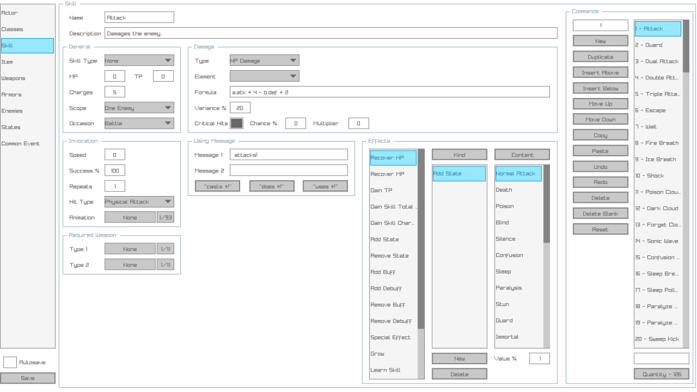

# **RGRay VXA Editor**

A modern, high-performance editor for **RPG Maker VX Ace** projects — built for speed, extensibility, and ease of use.

---

## 📸 **Screenshot**

Take a look at the interface in action:

> *Example: RGRay VXA Editor UI running with the sample RPG Maker VX Ace project.*

---

## 🚀 **Features**

- ⚡ **Fast and lightweight** — optimized for smooth performance  
- 🛠️ **Direct database editing** — modify your RPG Maker VX Ace data files with ease  
- 🔌 **Extensible** — designed to support plugins and future enhancements  

---

## 🔧 **Getting Started**

1. Clone or download the repository.
2. Launch:
   - `rgray_release.exe` on **Windows**
   - `rgray_release` on **Linux**

---

## 💬 **Community**

Join the discussion and get support on **The Maple Shrine** Discord server:  
👉 [Maple Shrine Discord](https://discord.gg/A8xHE8P)

---

## 📝 **License**

Licensed under the **GNU General Public License**. See the [LICENSE](LICENSE) file for full details.

---

*Built with ❤️ for RPG Maker VX Ace developers.*  
